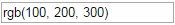

# input-number [](http://github.com/badges/stability-badges)

Make input field recognize numbers close to the caret, like chrome dev tools:

[](http://requirebin.com/?gist=797d1f7e065dae3380eb940545f06340)

## Usage

[](https://npmjs.org/package/input-number/)

```js
const num = require('input-number');

var input = document.createElement('input');
input.value = 'rgb(230, 110, 210)';

num(input, {
	min: 0,
	max: 255,
	step: 1
});
```

## See also

* [settings-panel](https://github.com/dfcreative/settings-panel) — simple settings for app, demo or tests.
* [autosize](https://github.com/jackmoore/autosize) — make textarea align it’s height by content.
* [autosize-input](https://github.com/yuanqing/autosize-input) — make text input adjust it’s width by content.
